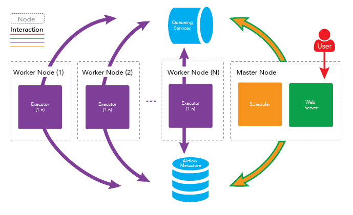

# **Docker Airflow Cluster Multi Node**

**Architecture**

**Diagram**


## I. Prepare
Tạo folder cùng cấp với file docker compose:
```
mkdir -p ./dags ./logs ./plugins ./data
```
~~~~
- Tạo file .env và cập nhật thông tin ip address trên tất cả các node (theo file .env_template):
    - PATH_DATA: đường dẫn thư mục dùng để mount data trong quá trình chạy airflow
    - PATH_CODE: đường dẫn đến thư mục lưu trữ code ETL
    - MASTER_HOST: ip master node
    - WORKER_HOST: ip worker node
- Cài đặt docker, docker-compose trên toàn bộ node
- Trên node master mở các port: 8080(webserver), 5432(postgres), 5555(flower), 6379(redis):
    sudo firewall-cmd --zone=public --permanent --add-port=8080/tcp --add-port=5432/tcp --add-port=5555/tcp --add-port=6379/tcp
    sudo firewall-cmd --reload
- Trên các node worker mở port: 8379
~~~~

## II. Setup Master Node
```
sudo chown $USER /var/run/docker.sock
docker build --rm --tag=mobifone/docker-airflow .
docker-compose -f master.yml up -d
```

## III. Setup Worker Node

```
sudo chown $USER /var/run/docker.sock
docker build --rm --tag=mobifone/docker-airflow .
docker-compose -f worker.yml up -d
```


then setup user for admin of airfow webserver: 

 - In master node, connect to webserver docker:`docker exec -it ${ID_DOCKER} /bin/bash`
 - Add super admin: 
```
    # Create a new user "airflow" for web UI, assign it "Admin" role, specify your email, first name, last name and password
    airflow create_user -r Admin -u admin -e chuyen.t@mobifone.vn -f Airflow -l Admin -p mobifone123
```

## IV. Cài airflow qua pip
```
Tham khảo: https://www.notion.so/cfc282/Install-Airflow-Cluster-909bce8578ea4a9e8a0031b84b916e78
```